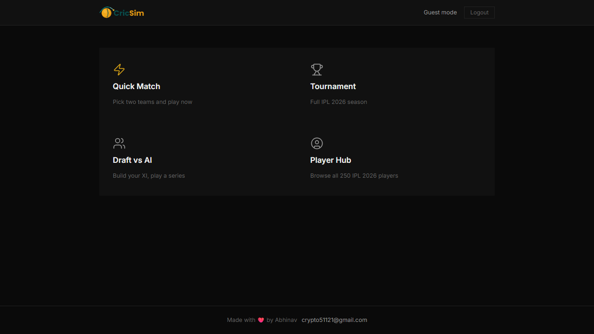
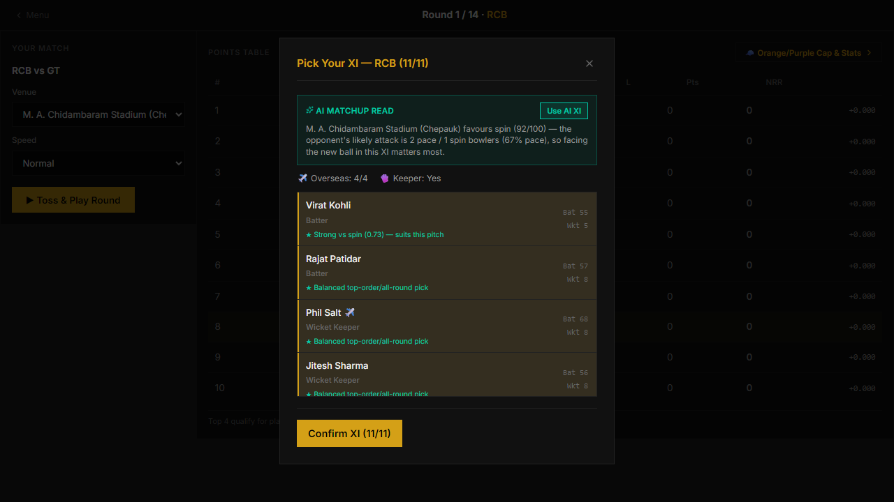
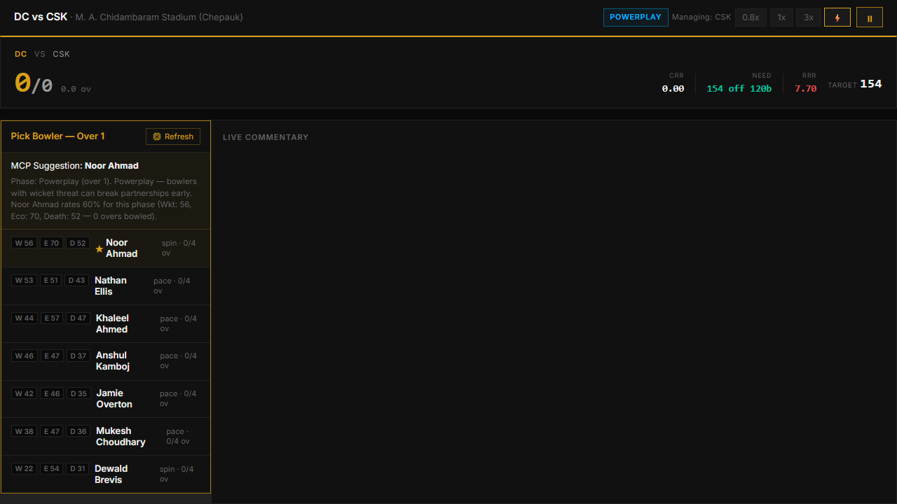
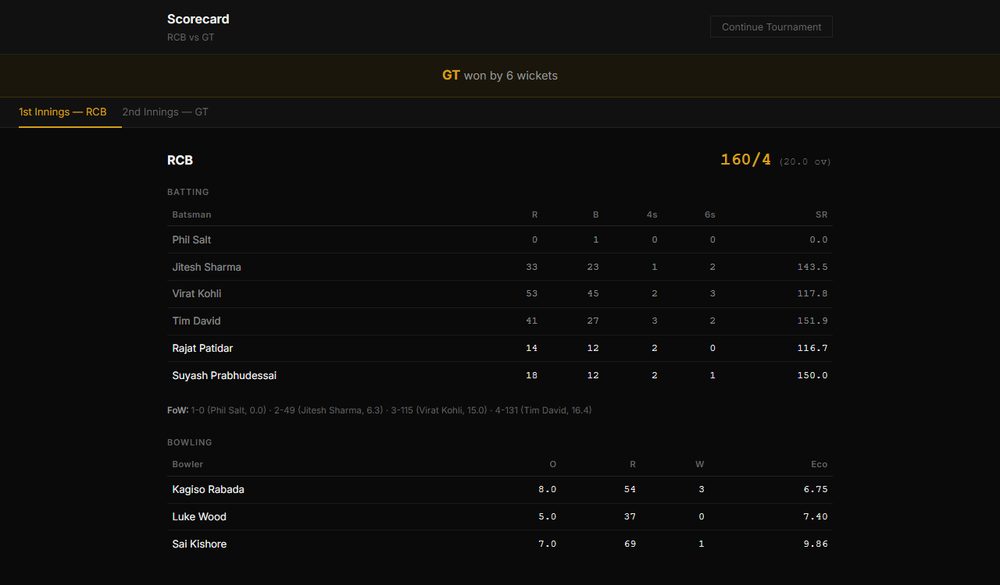
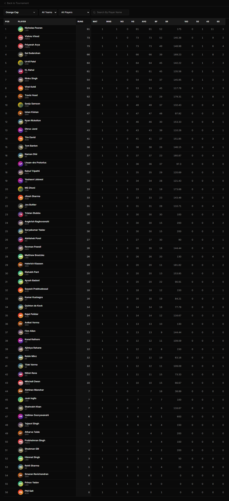
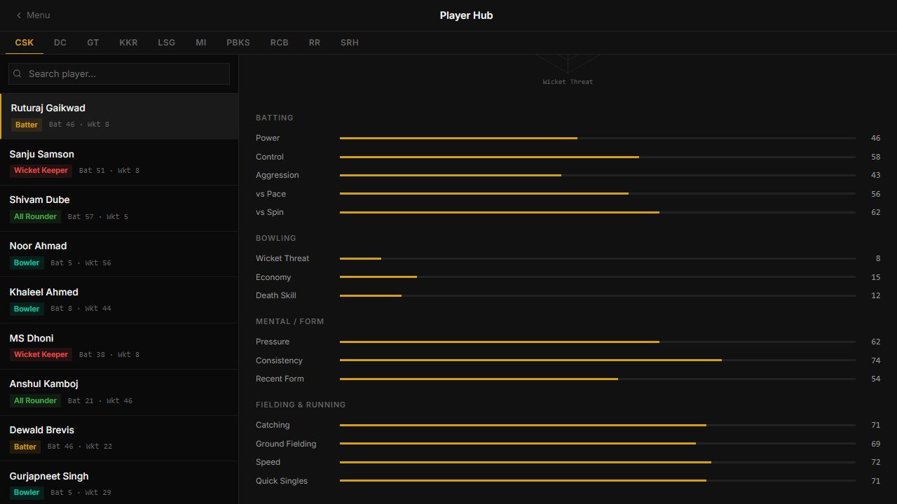

# 🏏 CricSim — IPL 2026 Ball-by-Ball Cricket Simulator

A full-stack T20 cricket simulator with a from-scratch probability engine, AI opponents, and a complete IPL-style season — built with FastAPI and React.

**Live demo:** [cricsim.onrender.com](https://cricsim.onrender.com) *(custom domain `cricsim.in` coming soon)*

> Free-tier hosting note: the app sleeps after ~15 min of inactivity and takes 30-60s to wake on the first request — give it a moment on cold load.

---

## What it does

Every ball is simulated individually from real player attributes (batting power/control, bowling economy/wicket-threat, pitch conditions, matchup vs pace/spin) rather than a scripted outcome table — the same match never plays out the same way twice.

- **Full Tournament mode** — 14-venue IPL-style season: round-robin schedule, live standings, playoffs, and a champion. Pick your own playing XI before each of your matches, with an AI-suggested lineup that reads the pitch conditions and the specific opponent's bowling attack before recommending picks.
- **Quick Match** — pick any two teams, watch instantly or manage one side ball-by-ball yourself (bowler and batting order choices every over).
- **Draft vs AI** — snake-draft your squad from a shared player pool, then play a series against the AI's draft.
- **Player Hub** — browse all 250 IPL 2026 player ratings with a stat radar chart per player.
- **Season Stats leaderboard** — Orange Cap / Purple Cap / most-fours / best-economy and more, computed live from every match actually played, not canned data.
- **Accounts & saves** — register/login (including Google Sign-In) and resume a saved tournament later.

## Screenshots

| | |
|---|---|
|  |  |
|  |  |
|  |  |

## Tech stack

**Backend:** Python, FastAPI, uvicorn, Postgres (Neon) via psycopg2
**Frontend:** React 19, Vite, React Router, Framer Motion, Recharts
**Hosting:** Render (single Web Service serving both API and the built frontend) + Neon Postgres for accounts/saves

## Architecture

```
engine/          Core simulation: ball-by-ball probability model, XI building,
                 AI bowler/batsman suggestion, tournament scheduling & standings
api/             FastAPI routes — one router per feature area (match, tournament,
                 draft, auth, teams, saves), thin: delegates all logic to engine/
frontend/src/    React app — one page per mode, shared components for the
                 live scoreboard, squad picker, toss modal, stat visualizations
```

Match state for live/interactive games is held in memory per session (a real match is a short-lived, high-frequency read/write loop — not a good fit for a DB round-trip per ball). Accounts and saved tournaments are the only things that need to outlive a server restart, so those are the only things backed by Postgres.

## Running it locally

**Backend:**
```bash
pip install -r requirements_web.txt
cp .env.example .env   # fill in a Postgres connection string (a free Neon project works)
python run_web.py
```

**Frontend (dev mode, with hot reload):**
```bash
cd frontend
npm install
npm run dev
```

Or build the production bundle and let the backend serve it directly (exactly what's deployed):
```bash
cd frontend && npm run build && cd ..
python run_web.py    # visit http://localhost:8000
```

## Deployment

See [`deploy/RENDER_DEPLOY.md`](deploy/RENDER_DEPLOY.md) for the full Render + Neon + custom domain setup this project actually runs on.
